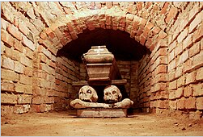
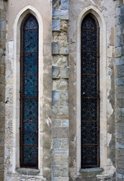

## 第三章 暴动

**在香达巴的**着陆场，格里姆排了好久的队，才拿一颗小宝石换了当地一袋谢克尔[^1]。这港口既接待长途飞行器，也接待其他星球的来客。港口里挤满了朝圣者。他们只是最新抵达的那一批，这批人里许多来自萨布洛布的其他大陆。

不少虔心的人都想把钱省下来，专花在住宿和购买圣物上，因此雇一辆轮胎鼓鼓、车窗漆黑的蒸汽豪华轿车进城，就成了可行选项。目的地：随便哪家专门办理长期房产租赁业务的事务所。贾克不想像梅林迪先前那样，冒充是其他恒星系来的总督千金，住在拥挤的商队驿站[^2]里。

香达巴是一座规模相当大的城市，尘土飞扬，气候寒冷。即便如此，城里还是挤满了人。据豪华轿车的司机所说，这里常住人口有二百万上下。现在这个数字至少膨胀到了六百万。

沿着城北，流淌着两公里宽的河流，河名“比希什蒂”，也就是“挑水工”的意思[^3]。城南是灰色沙漠。尘土和沙砾时常吹过香达巴，但风暴能堆出几厘米以上厚度的沙砾都算少见。尽管如此，按照当地习俗，轮胎还是像气球一样鼓胀——不论是轿车轮胎，还是那许多由长着蛇形长脖子和宽阔脚掌的、闷闷不乐的长颈驼拖着的马车轮胎。

警察待在装甲车里，监察着涌动的人流：披袍朝圣的、拉生意的、做贼的、行乞的、卖艺的、奴隶、工匠、传教士、拉着路人传教的狂热教众、搬运工、小贩、还有坠入爱河的蠢蛋们。天空是铜色的；红日辽阔。许多建筑都有圆顶和拱廊。

---

**看过几座郊区豪宅**的全息影像后，贾克挑中了最僻静、防守也最森严的那一座。一颗大钻石当做十年租约押金可谓皆大欢喜。房地产经理准为了自己捞到的高额佣金乐呵着呢。

司机把他们送到安静的城南，那轮浩然的红日正缓缓地开始下落。一弯褐红的日轮仍然鼓在天边，像一汪湖泊。已经有几粒星辰亮相了。

---

**宅子的围墙**顶端架着致命的铁丝网。豪华轿车停在锻制塑钢大门外。六个披着斗篷、手持自动枪的家伙路过这里。他们停下脚步，打量起轿车。

司机看上去很坦然。“是义警在巡逻呢。”他解释道。

格里姆先要来了车钥匙，然后和莱克斯与贾克一起下车，接受义警的盘问。

这位小个子男人自称是宅子的新任大管家。他报上了自己的名字，“格里姆”在矮人中很常见。至于这位死人脸的新房主，他报了个“托德·扎帕斯尼克爵士”的名字，贾克决定在香达巴就叫这个。那位大个头蛮子奴隶就没必要介绍了。

义警头子纡尊降贵地告诉新住户们，宅子空置期间，围墙顶上的致命铁丝网显然断了电。几天前，天气开始发寒，有一群狂热的朝圣者就爬进院子，在里面搭帐篷过夜。

“并没有闯入宅邸内部，尊贵的爵士，”那人对贾克说，“砍了珍贵的灌木来引火，又砍树做木柴。前任屋主不太在意要打点我们这些高尚的巡逻队呢。”

贾克对格里姆嚷了两句。这个小个子男人便把谢克尔分发给义警们。换作从前，贾克多半已经因为义警头子的敲诈和亵渎而咒骂出口了。这些货色懂什么叫高尚吗？高尚是奉献，高尚是献身。高尚是一名刺客兼艺伎，她这一生只拥抱过他两次，且每次都有绝佳的理由。不过，他们仨在这地界初来乍到，不该无故讨来敌意——倒该让人学会敬重。

“不过，我们完全有能力保护自己的人和钱！”贾克提醒。他从斗篷里亮出了“帝皇的仁慈”。

看到那把珍贵且古老、镀有虹彩钛合金、嵌有银色符文的爆弹枪，大家纷纷瞪大了双眼。弹匣里只有两发爆弹，不过贾克还有满能量的激光手枪。

格里姆拿着“帝皇的和平”，里面只剩一发爆弹。他又解开自己激光手枪的枪套。

莱克斯从背心下面绑在背后的携行具里抽出爆弹枪，里面弹匣还是满的。他又将一把激光手枪转移到正绑在他大腿上的多功能枪套里。先前枪套基本是空的，分成好几个隔层，看着像是用来给奴隶装工具的口袋。

他们在卡雷什的那几周里，格里姆没能给爆弹枪弄到更多弹药。他们的爆弹只能再发那么一两次声，就要闭口不言了。莱克斯那把还能发好多次声。激光手枪也能顶用。天色越加昏沉。影子在街道上逡巡。豪车司机不耐烦地清清嗓子。

摆够了派头之后，格里姆就收起了“帝皇的和平”，打开门锁。他把门推开，让车进去，又把车钥匙还给司机。见识过这些枪后，司机肯定不会一脚油门带着行李扬长而去了。“在里头等着。”小个子男人粗声粗气地下令。

司机照办了。义警头子则打量起莱克斯赤着的腿和少得可怜的衣服。他把斗篷领子向上拉了拉，打了个寒颤。

“天在变冷呢。”他评价。

莱克斯轻蔑地哼了一声。他受过训练，能忍受酷寒，也耐得住炎热。他的身体结构也做过相应改造。他的皮肤下面埋着一层与神经系统共生的准有机甲壳，让他能通过脊柱上的插口与动力甲连接。这层甲壳也能隔绝寒热。这些凡夫俗子懂什么叫冷吗？

奴隶秀出一身肌肉，其强而有力恐怕世间罕见。“一帮软蛋。”他用流氓的行话讥笑。义警们纷纷退到了一边。是被震住了？不！棕褐的影子沿街飞掠，朝宅邸而来。有十来个。二十个朝上。突然间，歌颂声响起：“祂那圣容，祂那真容，祂那圣容，祂那真容。”

“谁在拦祂真正的朝圣者的路？”一个狂热的声音高呼，“朝圣者带着圣遗物返回帐篷！让开，让开——凭祂的名！”

格里姆眼神很好。矮人是在昏昧的洞穴与隧道里演化出来的，那里以往照明稀少，能源配给严格受控。“他们就几把弹丸枪[^4]，头儿。”他说。

也就是发射普通子弹的手枪，寻常下层帮派的家伙事。尽管如此，贾克还是大喊：“警告你们！情况变了。放下武器。和平地把帐篷从这块地产撤走！”

无谓的屠杀不是帝国的作风。很多时候，为了维持文明、稳定、理智与信仰，总要叫人流点儿血，但这终归是件憾事。滥杀是无法无天的异端与混沌的做派。回应贾克警告的是几声咔吱的脆响，像细枝被踩断了似的。弹丸尖啸着飞过，一发砰地拍在敞开的大门上，其他几发打到围墙弹开。

信徒们满脑子即将到来的宗教圣典，陶醉在个体的正义感当中。于是，更加正义的爆弹枪有话要说。

**…咔哒-砰-嗖-咚-哐！**

**咔哒-砰-嗖-咚-哐…**

一发爆弹射出，即刻点火，推进剂推动爆弹飞驰。爆弹击中，钻进体内，随即爆炸。血肉、骨头或者什么重要器官迸裂开来。它向来都这么吵吵闹闹的。

与之构成对照的是，激光手枪运作时悄无声息。要是准头不佳，那一束手术刀般精准的能量很快就会消散。可一旦激光脉冲触及目标：那撕裂般的爆燃、那痛苦的惨叫！前提是受害者还有呼吸、肺部和心脏能让他叫出声来。

---

**大概有十个**朝圣者逃掉了。另有二十来个倒在地上，或死或伤。这几乎全是激光手枪的功劳。算得上一场小屠杀了。义警头子走了回来。在消逝的暮光中，他望着爆弹枪，眼神颇有些虔诚。

“是星际战士的武器吧，尊贵的爵士？我爷爷和我讲过，星际战士以前来过，那时候他还是个小孩。把我们当中的异形都清洗了。朝圣者在收集圣物，没错！”

那人从脖子上拉出一条皮绳[^5]。贾克抽动了一下。不过皮绳上吊着的只是一枚擦得锃亮的爆弹弹壳——义警随即亲了它一口。

“你从哪弄来的？”格里姆问。

“香达巴这里有，在当圣物卖呢。”

星际战士当年肯定是留下了没用完的爆弹匣。这宝贝让人不自觉顶礼膜拜。

“拿来，”莱克斯要求道，“它该在这。”[^6]他拍了拍自己的枪。

义警肯定会拒绝交出护符的。莱克斯除了一身肌肉，还有什么威信，能这样命令人家？

可并没有；义警似乎被某种理当如此的氛围搞昏头了。

“能亲眼看见这样的枪开火……”他喃喃地，把弹壳毕恭毕敬地呈了上来。他看了看那一地尸体。“明早就派清洁队过来，尊贵的爵士。”

“多谢了，”贾克说，“我的奴隶会拿朝圣者的帐篷当裹尸袋，把他们扔到街上。”

此时太阳已经落下大半。星星越发明亮。萨布洛布没有卫星。要是有的话，以这里大片陆地都如此低洼的地势，海水恐怕每天都要灌进内陆一大截。推动河流缓慢流动的动力，想必是行星自转产生的离心科里奥利力。正派的公民可不会用这些玄乎问题来腐蚀自己的思想，这是技术神甫操心的领域。

按照《通用指南》的说法，圣城有三座大神殿，此外还有无数供奉伟大神皇的小神龛。每座神殿都坐落在萨布洛布殖民统治初期建起的古城门旧址附近。

第二天一早，三人步行出发，前往东面的奥里恩斯神殿[^7]。之后他们可能会买一辆气球轮胎车。只要把《拉纳·丹德拉之书》上的宝石一口气全卖了，他们轻轻松松就能变成身价几百万谢克尔的富翁，而且还能再富上好几遍，不过只有傻子才会这么干。要了解一座城市，最好的办法就是步行，哪怕这得一连走上好几个钟头。

奥里恩斯就是梅林迪去过的那座神殿。奥里恩斯是她发现基因窃取者教团的地方。他们必须追随她的脚步。他们必须寻找更多与义警脖子上一样的圣物。

前往奥里恩斯神殿路上，他们远远望见一条宽阔大道上矗立着一座巨大的建筑物，与当地建筑格格不入。没有圆顶和拱廊：取而代之的是带扶壁和垛口的高耸城墙，以及中央的一座高塔。

“看起来挺像法务院。”格里姆不安地说。

《通用指南》里简陋的香达巴城市地图没有标出这样的机构。

而且到目前为止，他们也没有在这些拥挤的街道上，看见戴镜面面罩的执法者在巡逻。“之后最好去看看吧。”小个子男人提议。

---

**三人渐渐接近**奥里恩斯神殿本该坐落的地方。这里的建筑成了被夷平的废墟。整个街区都遭到了毁灭，却丝毫没有重建的迹象。即便如此，朝圣者还是在尘土飞扬的瓦砾间聚集起来。很快，揽客的就一股脑儿出现了。更别提乞丐、算命的、卖纪念品的，还有兜售开胃小吃的摊贩，来卖填馅老鼠和热香料酒。棚子、货摊和售货亭，像蘑菇一样到处冒了出来，就好像昔日的战场上办起了大集。废墟间生意兴隆，顾客往来云集，拉客的像黄蜂绕着多汁水果似地嗡嗡打转，想当导游的纷纷攀到游客身边。

为了免受骚扰，他们就雇了个向导。那是个骨瘦如柴的中年男人，光看长相就不像善茬。不知是什么腺体过度活跃，他的眼睛向外鼓起。他那上唇则被刀子割断了。也可能是他天生畸形，接受的手术又很蹩脚。仿佛是因为嘴上开了口子，他的话滔滔不绝地往外流。这个人叫萨姆贾尼。

“多谢三位老爷雇佣，三位来到香达巴，瞻仰神圣的尊容啊！”

“你的尊容不太神圣，是吧，萨姆？”格里姆评论，“和其他导游比起来，你生意不太好吧？”萨姆贾尼咧嘴一笑，有点骇人。“平常没谁在乎脸漂不漂亮，至少奥里恩斯没人在乎。”他邪笑起来，十分骇人。“这里从前可是有畸形混血种在潜伏的！”萨姆贾尼裂开的嘴唇与凸起的眼睛产生了绝妙的戏剧效果，叫人想起基因窃取者半人的杂种。放在平时，他肯定是个出色的导游，能把人吓得毛骨悚然。

“得承认，矮个子老爷，朝圣者大多一心想着圣容的时候，我这副面相确实有点在克我呢。”确实，再过两天，人间之神的面容就要在奥西登斯神殿揭开面纱了。

至于那场仪式到底怎么回事，等去了奥西登斯再弄清也不迟。眼下，他们来到的是梅林迪曾经到过的奥里恩斯。

可在这一片废墟当中，哪儿是奥里恩斯？萨姆贾尼带他们爬上一堆瓦砾。“就在您眼前呢！”

大片大片的废墟中，开着一个个通风口。显然，这些通风口连通着地下错综复杂的隧道、墓穴、厅室与地下堂[^8]。地下的残骸都清理过了。有梯子通往那些隧道。这些隧道里一度盘踞着畸形的教团——那是他们的老巢，最后由从传说走到现实当中的披甲星际战士清洗了。这里当然是很正当的朝圣地点。可是为什么奥里恩斯神殿一直没有重建？

“三位老爷，是奥西登斯的祭司不愿意重建奥里恩斯。”原来奥西登斯和奥里恩斯一直在相互较劲。奥里恩斯地位比较低，财富却格外多。它供奉着一口巨大的罐子，据说里面装着帝皇剪下来的指甲。人间之神是不朽的。祂的精神可以触及整个银河。那些指甲就仿佛依然长在祂手上一样，还在缓慢地生长。奥里恩斯的祭司会削下神圣的指甲屑来，装进银质圣物匣，再卖给信徒。

相比之下，奥西登斯神殿只能每隔一圣年（即五十标准年）展示一次祂的真容。

教团腐化了整个奥里恩斯神殿的管理体系。他们污秽的主教当上了大祭司。后来整个教团被星际战士一锅端，期间神殿连带周围归神殿所属的大片街区都被夷为平地，管理体系也就不存在了。

本地城市与世界的大教长[^9]本该为奥里恩斯任命一个新的大祭司。然而，在基因窃取者混血种起义期间，这位国教要员却在自己宫中被刺杀了。按资历排下来，奥西登斯神殿的国教大祭司本应成为他的合法继任者。

“三位老爷，可听明白了？”

年迈的奥西登斯大祭司拒绝为奥里恩斯任命新任大祭司。不管这份任命是给了新人多大的人情，新到手的权力很快就会让旧时的效忠化为乌有。奥西登斯大祭司是个虔诚的人，他坚持认为，首先他自己就必须得到更高层权威的正式批准，才好荣获升迁。他的论点是，既然不敬神的怪物能玷污圣城的一座大神殿，那么其他神殿的大祭司又有什么资格，来把他擢升上去？

“花了好些年在编写异端报告……”

最后，这份报告送到了三十光年开外星区枢机主教的办公桌上。星区枢机负责的教区体积有数百立方光年。据萨姆贾尼听来的流言，由于这份报告不是由萨布洛布最高教长办公室正式提交的（教长已经撒手人寰，没法提笔签字），所以一名文员又把报告退了回来。

这段时间里，那位恪守不渝的大祭司业已寿终正寝。他的代理继任者再次递交报告，同时附上一份申请，要求按立自己做高级教士——这件事该当是空缺的萨布洛布最高教长一职来处理的。就这样，几十年过去了。

事实证明，奥里恩斯的废墟与从前的神圣指甲大厅一样值得朝圣。真正受益的是一众向导与商贩，而他们全都得从收入中划出不菲的什一税，交付给负责监管的奥西登斯神殿。

“极限战士来过嘞。”莱克斯说。

“是来过，大个子老爷。”

“啊啊……”

在这种环境下，莱克斯实在很难继续装成粗鲁蛮子的样子。他必须检查小贩托盘上的某些圣物。

结果这些圣物大部分都是赝品：只是爆弹的实心模型，没有穿甲弹头，没有推进剂，没有质量反应引信，也没有爆炸物。

一番仔细检查过后，莱克斯建议格里姆买下两枚正品爆弹。价格高得离谱，简直高到天上去了。可莱克斯也高得很、壮得很。他绷起肌肉，又吼了些什么诸如造假、亵渎之类的话，小贩就再不敢拒绝格里姆开的价了。

最后，他们来到了露在外面的地下堂前。

---

**贾克低头**望进其中一座地下堂，嘴唇无声念出了梅林迪的名字。

她曾披上怪物的伪装，从这一座地下堂里悄悄穿过。如今这里却被一群目瞪口呆的观光客弄得俗不可耐了。没有一个人知道她当时是怀着怎样痛苦的勇气。这些向导不知道，萨布洛布的其他人通通不知道；知道的只有贾克本人，还有格里姆与莱克斯。

庸俗啊！贾克真想拎着鞭子跳进地下堂，双臂一通挥舞，把这些昏头昏脑的游客统统抽出去。他们怎敢用自己无足轻重的脚步，抹去她尘封多年的足迹？

“下去看看怪物的巢穴？”萨姆贾尼提示道。	

贾克从喉咙深处朝向导低吼了一声。这个向导本身也是造就这一切庸俗的器具之一。他为什么就不能像野兽一样低吼呢？难道他不需要将自己的凄切推向极烈的疯狂，同时暂且放弃自己的理性意志吗？

格里姆赶紧插了进来：“那后来怎么样了，萨姆——我是说，那罐指甲咋样了，嗯？”

“在战斗中砸碎了，洒得到处都是，亚人老爷。人们现在还能从瓦砾堆里捡到祂神圣的指甲，那通常很难认出来。”

“我猜也是。”格里姆表示赞同。

“私藏指甲是要受鞭刑的。现有的指甲全都由奥西登斯妥善保管。在这里找到一片，赏半个谢克尔！”

“那些指甲还在生长，是不？”

“指甲都锁在奥西登斯，从不拿出来展示。”

“你真让我大开眼界。”

“我曾祖父那时候，指甲弟子和“真容”信徒之间，有过许多血淋淋的斗殴……”

贾克从一个通风口走到另一个，停步向下凝望，陷入苦涩的漫漫沉思。莱克斯默默跟在他身旁。

---

**对莱克斯来说**，同样地，此地本可以十分纯净，却被盗贼破坏了。这里是高贵的星际战士英勇作战、大获全胜的地方；这里无疑是有些战士的埋骨地，他们的基因收存腺由医护工作者恭恭敬敬地摘取。蓝色的极限战士来过；他们净化；他们离开——留下了播撒传奇的种子；至于没用过的爆弹，则绝没有圣物生意里暗示的那么多。

莱克斯要是能弄到一整包弹匣，他得多精神振奋。可那样一来，他不会觉得自己更像个冒牌货了吗？凭着肌肉发达，就假装自己是星际战士——可他真的就是星际战士啊！没错，一个叛逆的骑士，扯掉了前额的服役钉……愿罗格·多恩，他生命的曙光，为了某种大义[^10]，在这段自我放逐的时光中与他同在。

尽管格里姆竭力阻拦，可在莱克斯沉思的档口，萨姆贾尼还是突然窜过来搭话了。他热情地鼓着眼睛抛了个逗弄的眼神，大声说：“您简直都能冒充极限战士了，大个子老爷！”

冒充？怎么冒充？不穿盔甲，跳进地下堂？冲过人挤人的隧道，从那些小偷与乞丐里杀出一条血路！

冒充极限战士——可他是堂堂正正的帝国之拳！莱克斯的手条件反射性地向后扬起，宽大的巴掌眼看就要扇到萨姆贾尼头上。

格里姆插话道：“萨姆！这城里有法务院，是不？有法务院欸，法务院！”他叽里呱啦。

莱克斯忍住了。法务院，没错。啊，就算他折断了向导的脖子——就算他扇掉了他的头，法务院也不会多看一眼。可这里竟会有法务院，梅林迪又从未提起过：啊，那就可能是个麻烦。

帝国法务院不关心小偷小摸。谋杀和抢劫？让当地警察去操心。针对帝国的罪行，才是法务院会管的事务。而看起来他们这三位卷进去的，除了可怕的秘密叛国活动还能是什么？

萨姆贾尼知道自己刚刚逃过一劫吗？那些雇佣他带路的热情朝圣者想必常常举止失当。“有法务院在呢，当然咯，”向导殷切地叽叽喳喳，“极限战士来过之后没几年，就在破土开工了。”

这说得通。一座重要的国教神殿，被狡猾的非人混血种渗透，连这个世界的行政机构都遭到腐化——这就是懈怠的证据。懈怠就是罪行。

据萨姆贾尼所说，当时的世袭总督哈基姆·巴德沙阿，以及他全家上下，都被赦免了异端的罪名。巴德沙阿王朝得以延续。他们缴纳了巨额罚款，用来修建辖区法务院；工程花了十年完工，之后维护费用也由此承担。

萨姆贾尼提到，法务院大门通常都是关闭的。里面的仲裁官似乎主要忙着自己的事，还有自己的阴谋。

这时贾克也开始留心听了。

“法务院的执法官不会定期在香达巴巡逻吗？”据萨姆贾尼所知，不会。

“执法者也不派执行小队来搜寻罪犯？”

萨姆贾尼似乎不知道什么是执行小队。“人们很容易就能把自己弄死。”萨姆贾尼说。[^11]他不肯再解释。也许他只是在暗指宗教派别间的对抗与斗殴。

---

**不久，他们离开了**挤满人的荒地，也告别了他们的情报人，徒步穿过城市，朝奥西登斯神殿的方向走去。途中会经过那座法务院，可以去仔细看看。要是中途再停下欣赏那些小神龛，或者大鱼市和长颈驼场，再眺望几眼不远处的总督宫，那么这一趟就要耗上两三个小时。

---

**来到那座**巨大的法务院附近，他们隔着一条宽阔而拥挤的大道观察了一会儿。法务院森森地占据了一整个街区。显然，为了给这么一栋大楼腾地方，有好几公顷的房屋都被拆除了——要么就是早就毁在了基因窃取者的暴动里。

坚固的墙壁巍然高耸，上面嵌着数百扇窄高顶尖的柳叶窗。这些窗子太窄，任何人都钻不过去，却正适合用作射击孔。堡垒突出。扶壁加固。狞笑的石像鬼从带垛口的胸墙和尖顶角楼下面探出头来。中央尖塔顶端是一颗咧嘴笑的骷髅头。法务院上层绕着一道十米高的雄伟檐壁饰带，上面无颌颅骨的图案不断反复，中间穿插着“PAX IMPERIALIS – LEX IMPERIALIS”的字样。[^12]

帝皇之和平，帝皇之法律。

对莱克斯来说，倏然看见自己的名字大大地写在高处，简直像是在控诉他擅离职守——仿佛那圈饰带上刻的是臭名昭著的罪犯们的名字！

“哈，好歹上面没我的名字，”格里姆开玩笑说，“他们还没开始找我。”

仲裁官有没有在特意找人？正如萨姆贾尼所说，装饰华丽的塑钢正门紧闭着。

这或许是因为当下正值圣年中最神圣的时节，朝圣者人流量实在太大。驻地仲裁官兴许不大想让一大坨人不管不顾地从门口挤到门后的什么大庭院里。

也可能正如萨姆贾尼暗示的那样，由于萨布洛布看上去万事太平，该法务院就把心思全花在了自己的内部政治上。
 
---

**贾克想起**自己从前在一个更温暖的世界上，拜访过的一座法务院。那里的大门一直敞开着。警惕的执法者会扫描庭院内的人群。庭院成了一个完整的小社会，争论的请愿者可能已经扎营几个星期乃至几个月；有承办商给他们供应药草茶和香料蛋糕；有厨子沏茶倒水、烘烤点心；有文员替他们记录证言；有法律顾问教他们酝酿措辞，其中所涉及的，也就是成百乃至上千年前帝国法令里的细枝末节。有些请愿者可能要在那戒备森严的大院里度过半辈子，而那还只是法务院最外面的一层。最虔诚的申诉人甚至可能会加入到武装执法员的队伍，那时他们最初要打什么官司早就无关紧要了。

萨布洛布的情况有所不同。法务院大门紧闭。

贾克对同伴们说：“在法律眼皮底下办事有很多好处。”虔诚的喧嚣几乎淹没了他的话，附近其他人都没法偷听。“法律看得很远，却未必会留心脚下。”格里姆朝下一个十字路口支架上高耸的显示屏点点头。下方，供奉品不断落入一只硕大的青铜碗，叮叮当当的声音几不可闻。目前显示屏上一片空白。这时他们注意到，类似的显示屏还有许多，隔一段距离就有一块。

亚人拦住一个朝圣者打听起来。那些显示屏似乎与法务院无关，甚至也不是普通警察拿来监控用的。

六百万人不可能都合理希望能直接亲眼目睹“真容”揭幕。而在这座圣城，不论身在哪里，能通过屏幕看见揭幕，也就等同于亲眼见证了。屏幕上甚至还能看得更清楚点。

“我不是指责仲裁官懈怠了，”贾克说，“不过比起严谨地查案，他们或许更关心自己显赫的权势。有时是会有这样的诱惑。法务院自成一个世界。”

那些大门之后，那些不管什么庭院之后，都将是一座巨大的迷宫，厅堂与地牢、军械库与营房、靶场、缮写室与档案馆、仓库与厨房与训练馆与车库。法务院与要塞修道院没太大不同，都是拥有独立主权的领地。披袍仲裁官统领法务院执法官，执法官管辖装备精良、忠于职守的执法者，一旦帝国法律遭到侵犯，执法者就会出动执行法律。

“我想，”贾克说，“现任巴德沙阿领主应该没有什么密谋，就像当年的哈基姆·巴德沙阿一样。何必密谋呢？他的税收就能覆盖法务院的维护费用。当地行政机关里的混血种许多年前就清除干净了。仲裁官们肯定是认为，他们只需要出现在这里，就足以镇住叛乱。这是错的，大错特错——不过正合我们的心意。在规模更小的城市里，我们会更惹眼。不管怎样，我们还是该待在太空港附近——除非我们能发现沙子底下埋着不为人知的网道入口！”

要发现这样的入口，就得用到阿祖尔·彼得罗夫那只被割下来的符文眼……

那个已故领航者的亚空间之眼上，曾刻了一条通往网道中黑图书馆的路线。哪只眼睛有没有可能以某种方式，感应到网道门的存在？

可那只致命的眼睛，除了投出能杀人的一瞥之外，还能怎么用呢？而且凭什么能假定萨布洛布上会藏着入口？

---

**他们才向前**走了一百步左右，来到显示屏下方的大青铜碗旁边，前方忽而爆发出一阵喧乱的吵嚷，比平时的喧闹要大声得多。呼喊像暴风一样席卷人群，混杂着各种不同的方言：

*“在提前展示‘真容’呢！”*

*“他门在展似真容啦！”*

*“祭司在开始展使祂的脸啦！”*

*“圣容在显现啦。”*

无稽之谈。那些显示屏依然一片空白。奥西登斯祭司是不可能提前两天公开揭幕真实圣容的。

可对于那些千里迢迢，从星球另一端乃至其他星系的其他星球赶来的朝圣者来说，这样的谣言太有可信度了。错过那个至关重要的时刻，可谓不能忍受、痛苦至极。五十年才等来一次，错过了！谣言像火风暴一样扩散。

这时谣言又有了新的说法，听起来还有点儿疯狂的逻辑性：

*“这是在给行过贿的私下看呢！”*

*“行过贿的太多了，私下看就成公开看了！”*

*“所以算在公开展示呢！”*

显示屏依然不祥地空白着。

结果就是彻底的恐慌。人群涌动。朝圣者从侧道上涌进人潮。一群人浪起伏推挤、尖叫抓挠。贾克、格里姆和莱克斯奋力挤到青铜碗后方躲避。那只碗里就算空空荡荡，本身也肯定足有一吨重。

法务院边上的一些暴徒开始疯狂呼求，拳头砰砰砸着法务院大门。一千个声音要求正义。

*“我们付了钱的！”*

*“我们在付钱呢！”*

*“虔诚的朝圣者前来请愿！”*

这种所谓的不公正，归法务院管辖吗？根本不归。当然不归。

可是就在法务院大门口暴乱滋事，那就和法务院大有关系了。拳头砸在塑钢大门上，这属于犯罪袭击行为。很快，高处柳叶窗里就探出一把把激光枪向下瞄准。细长的枪管上夹着管子。作为扩音器的石像鬼嘴里轰然响起一个声音：**“善良的公民与朝圣者们！停止对法务院大门的袭击！以帝皇之名，和平离开此地！”** 可袭击仍在继续。

石像鬼再次高呼：**“立即停止！朝圣者，不要以自己去撞击法务院这块磐石！散开！不要逼迫我们采取致命手段！”**

呼吁无效。砸门继续。

片刻之后，似乎有大枚的银币纷纷撒落下来，从高处看不见的执法员手中落到人群里。银币，算是象征性地退还了朝圣者自以为白白花掉的钱财。银币，也可当作额外献给帝皇的供奉，让朝圣者捡起来丢进青铜碗里。

银币开始在人群中爆炸。

“是破片手雷！”格里姆叫着矮身躲避。

破片手雷，没错。装载激光枪管上的管子是榴弹发射器。

每一枚手雷都碎裂成几十片呼啸的锋利碎片。碎片撕开衣服，割开血肉，切断动脉和气管，致残，致盲，在高举的手与脸颊上划出血绘的符记。

那是一片怎样的跌倒与尖叫。那是一片何等痛苦的疯狂，像是被刺激的野兽。相当一部分朝圣者身上带着武器，而不只是普通的小刀或者带钉铜指虎。只有傻子才敢满世界走又不带防身家伙。出现了弹丸枪。手弩。甚至激光手枪。那些还没受伤或失明的还能如何是好？等着更多手雷从天而降？等着激光脉冲？逃也没法逃。挡路的实在数不胜数。站着的。踉跄的。倒下的。

带武装的朝圣者开始向柳叶窗还击。他们发射子弹、小箭与激光。想打中基本没可能，连瞄准都困难。可到了这一步，法务院本身，乃至正义本身，显然遭到了攻击。

塑钢正门平稳地隆隆打开——人群起伏涌去。

过了大门，前路依然是堵死的。三辆装甲车并排停在那里，周围发动机废气烟雾缭绕。

其中两辆装载重机枪。中间那辆是自动炮。三辆车顶都是执法者小队的平台。诡异的反光面罩抹去了他们的面部特征。他们的制服黑沉沉的。活脱脱	一群脸孔是镜面屏的乌黑机器人。

榴弹发射器射出一通破片、窒息毒气和闪光弹。接着，自动炮蛇口一般的炮口喷出实心炮弹。那些大机枪也哒哒发射出重型子弹的风暴。

炮弹与子弹割倒了一垄闪瞎了的、喘不上气的、流血不止的暴民。接着又是一垄。再是一垄。重型子弹打在贾克、莱克斯与格里姆藏身的青铜碗上，纷纷弹开。

这座法务院就像一只洞里冬眠的苔色熊，被人惊扰苏醒。又或者一窝杀人蜂。
 
---
 
[^1]: shekel，谢克尔或者说舍客勒，源头是古老的美索不达米亚银币，在在西闪米特语系很常见，也是圣经里的货币。现在的以色列法定货币也名为谢克尔。
 
[^2]: caravanserai，古代贸易线路的商队驿站，尤其指阿拉伯和波斯地区的丝绸之路沿线驿站。其中caravan源自古法语caravane源自阿拉伯语qāfila，指商队；serai源自土耳其语saray，指大楼。
 
[^3]: Bihishti，在英语中指印巴地区的挑水工，但有趣的是该词的波斯语词源bihisht意思是天堂。
 
[^4]: stub gun的翻译在战锤是比较混沌的，不论如何这东西指的是制作难度较低的低速大口径手枪，类似左轮；更多是帮派成员或者其他类似角色在用。
 
[^5]: 这个皮绳原文thong，其实也是丁字裤……译者本人很怀疑这里真的是丁字裤。
 
[^6]: 本篇的莱克斯说话时多有伪装出口音的地方，比如这里的“拿来”原文为Gimme that，译者将酌情翻译。另，如上一章所言，本节的本地人语言多用-ing，酌情翻译为“在……呢”。
 
[^7]: Oriens Temple，这个Oriens就是拉丁语东方。后面的奥西登斯神殿Occidens则是拉丁语西方。
 
[^8]: 这里的“地下堂”原文crypt，中文常称为地下墓室。这个地方指的是教堂的地下空间，主要位于祭台、后殿、圣所下方，通常是石室，常为放置棺柩、骸骨、圣髑等之用，也可作为教堂内的小堂。
      
      也就是说，可以是这样的：
      
      也可以是这样的。

[^9]: Pontifex Urba et Mundi，可疑的拉丁语。Pontifex是宗教高级领袖，Urba是划定城市边界urbo的现在命令式，et就是和，Mundi在此应是世界mundus的单数属格。
 
[^10]: for a greater good，熟悉战锤的大家都知道钛的“上上善道”也是greater good。这个词可以说离开文学领域依然是惯用词，常见在各种公共措施政策法令中，大意是集体优先、大局着想、为了多数人的共同福祉；隐含台词是牺牲小我。
 
[^11]: 执行小队原文execution teams，但execution也有处决的意思。顺便在这里说一下，译者被本章内法务部系名词击败了，所以在此列举：Judge仲裁官 Arbite执法者 Arbitrator执法员 marshal 执法官 courthouse法务院。
 
[^12]: 本段内柳叶窗lancet window，早期英式哥特建筑标志。如图：

       frieze檐壁饰带，位于楣梁与檐口之间。如图：
       
       而最后一句的PAX IMPERIALIS – LEX IMPERIALIS，在下一行译文中已经给出含义。其中有趣的是pax imperialis和“罗马治下的和平pax romana”结构一致；Lex是法律的意思，也是莱克斯的名字。
