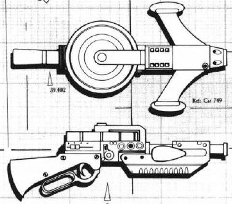

## THIRTEEN 第十三章

闪电张牙舞爪地撕裂黄疸的天空，仿佛是为了宣泄现实与非现实间之间的张力。云层里好似发生了溃烂，黏稠的脓液取代雨水连绵滴落。阴云积聚，如同空中扎堆的腐烂肿瘤。绿幽幽的日光透过看上去充满氯气的阴霾，时而为这番景象打上几束叫人犯恶心的光。日光之下，布满耸立着的侵蚀石刺与石塔的嶙峋地貌像长了一层霉斑，而经过迷彩屏蔽的恶人苦难号在这儿瞧着与自然景观无异。

幻象翻卷着，似乎正试图凝结成实体，与牛奶变成黄油的法子异曲同工。球状植物扭动着毛茸茸的花朵，饥肠辘辘地探向那些舞动的幽魂。这些花朵完全是一派腐肉的色彩。

---

一个小时后，他们接下了一起极其顽皮而戏谑的战斗挑战。

一个公牛人披着板甲，领着十来个蹦蹦跳跳的怪物，从一座石笋似的岩塔后面绕了出来。“吼吼，吼吼，”这头“牛”咆哮着，“小宝贝们，看看咱们找着什么乐子了？”

领头者的脑袋两侧有一对令人望而生畏的弯角，犄角向前突出，布满了干涸的血迹。他的盔甲是按照骸骨的形状锻造的，金属骨头箍着他的大腿，骨与骨焊接一处，形成了符文的图样。狞笑的异形头骨盖着他的双膝，靴子与手甲上也裹着硕大的趾骨与指骨。

人造骨骼兜着他那有伤风化的鼓鼓囊囊的裤裆，上面镶嵌着血色的石头，就好像患有某种溃疡。他还披着一件精美的缎面斗篷，在微风中飘得很有派头。脖子上还有一条大金链子，上面挂着色情护符。贾克感觉到，公牛人周身散发出一种怪异又粗野的肉欲。他这身行头似乎是在说，只剩一把枯骨也不妨碍交配，哪怕是铁石也能想法子放荡……虽然这种放纵绝不温柔。

领头者身后，跟来一个小跑的“乌龟人”，那颗满是鳞片的脑袋正从桶状的壳里探出来。龟壳上亮晶晶地点缀着五彩斑斓的星辰与新月，活像是一个行走的星系，或者某位疯术士。一条条丝带宛如燃烧的气流般拍打飘扬。到了晚上，他是不是会爬出龟壳，躺到榻上，裸露出那娇嫩湿软的身体，把全身的*快活神经*都交由某条湿漉漉的大舌头来服侍？贾克甩了甩头，想把这画面从脑子里赶走。

另一个战士穿着黄铜背心和护腿，上面粘着金色穗带，就像甲胄上爬满了毛毛虫；在他原本是左手的位置可以看见一束触手，头上则是一顶浓密卷曲的假发。

还有一个，明显是雌雄同体，穿着塑晶盔甲，伸着一只镶满徽章的大龙虾钳。有个战士身量瘦高，胸脯干瘪，靠一副叮零当啷的华丽外骨骼支撑身体，长着一颗苍蝇头，头顶的帽子佩有帽徽和羽毛。她胯下还探出一根包铜的产卵器。在她身旁，一只发情期的双足公羊人正迈开大步，口水直流，脖子上围着一圈浆过的硬纱拉夫领[^1]，手肘处点缀着蕾丝褶边，还披了一件天鹅绒斗篷。

只有一个壮汉看起来像个纯种的人类。他的盔甲很像高贵的星际战士动力甲，不过是某种噩梦般可怕的仿冒品，上面刻着上百张恶魔的面孔，但他却不屑于佩戴头盔。硕大的凸缘管道从他脑袋后面斜斜生出，就像是反向地复制了公牛人的那对犄角。他的头颅拥有大理石像般的高贵典雅，头发也烫染漂白成了洁白的波浪卷发。在他那鹰钩鼻尖上钉着一枚祖母绿的鼻环，在贾克看来很像一滴鼻涕。他的一侧脸颊上纹有剑与鞘的刺青，摆放方式宛如林伽与约尼[^2]。

在这个叛徒星际战士身旁，一个变种女人正翩翩起舞，生得既美艳又骇人。她的身子苍白娇小，金发如云，紧身锁子甲上绽着玫瑰花结与缕缕薄纱。然而，那双翠玉似的眼眸却是一对鼓胀的椭球，歪歪斜斜地长在那张本该性感可人的脸蛋上。她的脚是饰有黄玉环的鸵鸟爪，手则是几丁质的彩绘钳子。一条锋利的尾巴在她丰满的臀部后方甩动。看起来真像一个混沌女魔！古戈尔一见到她，嘴里就发出一声呻吟，脚步也不由自主地往前迈了出去。格里姆咬紧牙关。

这伙人装备着镶金爆弹枪和动力剑，剑柄嵌有珍珠母。他们散开阵型，排成了一道诡谲的散兵线，停下脚步，仔细审视这三位穿着正统动力甲的身影——两套正常尺码的动力甲，还有一套小号的。他们面甲敞开，框显出纯天然的面孔。

着陆之前，格里姆已经给他们自己的宽肩装甲喷涂上一层病态的黄色，好与沙漠融为一体，并遮住那些反恶魔符文与红色虔诚圣像。贾克忍着恶心与深深的不安，亲手涂上扭曲的叛徒纹章，比如荷鲁斯之眼——他画得很潦草，这样它们的效力可能会减弱，但也足以在匆匆一瞥下瞒天过海。贾克的武器架上插着一根力场杖、一门灵能炮和一把通过管道连接着挂扣燃料罐的粘性火焰喷射器；钢制枪套里插着一把镀金嵌花激光手枪。格里姆和古戈尔则更倾向于使用爆弹枪、激光手枪和星镖发射器。

这伙人打量着三位身份不明、武装精良的闯入者……还有一位基因窃取者变体。没错，她是众人的护身符，能替他们做担保——如果真有什么人能保他们周全的话。

“色孽，色孽，”公羊人咩咩叫着，抖了抖拉夫领。苍蝇头和乌龟人也跟着唱和起来。苍蝇头还很讽刺地脱帽致意。

“荣耀归于色欲军团！”那个星际战士的浮夸仿品大喊。他喊的究竟是“色欲”还是“迷失”？[^3]还是两者皆有呢？此人满脸嘲弄地咧嘴笑了起来。

一股寒意顺着贾克的脊椎蜿蜒而下。色孽，执掌变态快感与痛苦之乐的主宰。或许正是在色孽所统治的行星上，能左右大脑痛觉与快感中枢的实体才得以铸成。

这群拦路的乌合之众，这些时髦又别致的怪物，似乎正打算耍一场荒诞甚至恶毒的游戏。问题来了，他们能被糊弄过去吗？在贾克身旁，梅琳迪弓起脊背，仿佛下一秒就会发挥基因窃取者闪电般的速度，冲到他们中间去。

她咔嗒咔嗒地捏着爪子；那颗野蛮的马头向前探。贾克打了个手势，拦住了她。

“从我们这位同伴的模样上，你们就该看出，”贾克高声喊道，“我们早就往那什么皇帝的脸上吐口水了。”他像宣示主权般拍了拍梅琳迪的肩膀，“这是我的魔物小情人，我大变样的亲爱的，她带我领略了极乐与痛苦。”[^4]

公牛人盯着梅林迪。他真的相信她恶魔附体了吗？他舔了舔嘴唇，转头看向同伴。

“我们欢迎*改信者*，不是吗，我好色的伙计们？”他喷了个响鼻，“当然了，在那之前，我们得先测测他们有多欢喜，对吧？”

*“他么呢有多混喜”……* 这些堕落者讲起帝国哥特语来，带着一股颓废的含混口音。[^5]

苍蝇头咯咯笑了。“诶，没错，自当是先来一场入会礼。”*自当斯先嘞一场入卫礼。*

贾克想，如果可能的话，无疑最好避之为妙。他摆出一副傲慢不屑的派头，指了指四周。

“这避难所既邋遢又沉闷。我想找的可不只是一片流脓淌水的乱石荒漠。我要找的是九头蛇之巢。我是九头蛇至高领主派来的使者。”贾克从装甲的收纳袋里抽出一根实体触须，将它扔在地上，那东西不断蠕动。

“哈——”公牛人笑着回答，“那些宝贝儿骗子领主啊……”

骗子？哪种意义上的欺骗？密谋集团是欺骗过这颗星球上的叛徒，还是正在背叛帝国？公牛人高声喊道：“你一定得去见识见识我们城里那些迷人的折磨地牢，改信者，只有去了那儿，你才能好好领略这世界究竟能提供什么好东西。”

这究竟是邀请，还是可怕的威胁？贾克很难理解这位混沌勇士的思维过程，那本就是……一片混沌。

就在那一瞬间，贾克心中涌起一股强烈的冲动，想要卸掉装甲，跟梅琳迪扭在一块儿。只要他在这群怪物观众面前兑现方才的吹嘘，嘿，他们就会放过他，还会把他梦寐以求的情报悉数奉告。

这种恶毒的暗示亵渎了他们在飞船上欢好时所感受到的一切珍贵体验。他正遭受着一场精神攻击，手段淫邪又阴险。

梅琳迪也未能幸免。她嘶叫着，一只爪子紧紧抓住自己的腹部。除了用来将卵用一吻送入受害者体内的舌头之外，基因窃取者没有其他生殖器官。可现在，梅琳迪的小腹下方正隆起一个育儿袋，仿佛正等着接纳贾克。她的心智——那负责控制这副虚假躯体的形态的心智——正遭到操控。动手的不是掉在沙地上的那截九头蛇碎片，她对那东西免疫。而是……

那么目的呢？啊，为了让贾克脱掉动力甲，诱骗他离开自己的庇护所。这些人恐怕并不确定自己的兵器和蛮力能不能与动力甲硬碰硬。贾克抽出力场杖，对着公羊人就是一记发射，后者踉跄后退，他狡猾的灵能攻击则被抵消了。

“我没那么好骗！”贾克挑衅地吼道。

“那是当然，”公牛人答道，“看来格拉尔’普林刚才误解了我的意思。正如我所说，在我们接纳你们之前，必须先测测你们的欢喜程度。这也就是说，*你*那深情的头号卫士，得先招呼*我们*的情人呢。”

那个漂亮而可怖的雌性摇曳着走上前来，尾巴劈着空气，钳子咔嗒作响。

“她们算恰逢对手吗？恐怕还不够吧。卡玛布拉克，我们放荡的侄子兼侄女，会助她一臂之力。”

那个长着巨钳，用另一只真正的手攥着动力剑的双性人迈步上前，嘲弄地鞠了一躬。“我想，让泰斯图德也上吧。不过不带枪。我们可不想胜之不武。”

于是乌龟人扔下爆弹枪走上前来，手里依然提着一把动力剑。

“啊，且慢，”公牛人补充，“我们要画个决斗圈，再加持一点封锁咒。至于你，灵能者大人，”他压低双角，阴毒地看向贾克，“你可别插手啊。斯莉茜，你来！”

变种女人跳起了一支快舞，锋利的尾巴在尘土中拖行。她划出一个宽阔的圆圈，只留一个小口没有封死。

贾克盘算着。凭他、格里姆和古戈尔，靠着更好的装甲，应该有把握杀光这些个扭曲的叛徒吧？

可那样能查到什么呢？当然，他们或许能生擒头领……

但面对一个教导信徒要在痛苦中作乐的色孽门徒，贾克那套刑讯工具有什么用呢？梅琳迪发出吱吱的叫声。格里姆充当了翻译。

“先把他们骗过去吧，头儿。她准备好开打了。”

伪装确实是上策。所以，贾克必须表现出接受挑战的样子。梅琳迪得一挑三，对方手里还有两把动力剑。她毕竟不是四臂齐全的基因窃取者，那种窃取者特有的蹲姿，不会妨碍刺客杂技般的灵活身手吗？

梅琳迪不等指令就踱步走入圈内，与那三人接近。斯莉茜用尾巴封死了圆圈的最后一截。空气微微泛起光，似乎有一座能量圆顶扣住了这片角斗场。

“我不忍心看。”古戈尔咕哝着。

“去吧！”格里姆喊道。

贾克提醒自己要时刻警惕灵能冲击；他不能把注意力全放在这场战斗上。

梅琳迪尽力抬起身，猛地冲向乌龟人。这是她的对手中看上去最笨拙的一个。乌龟人高高举剑挥砍。她顺势扑倒在地，从剑锋下滚过，双爪扣住对方的脚猛地一拽。乌龟人轰地仰面摔倒，脑袋早已缩进壳里。

梅琳迪并未乘胜骑跨到对手身上，而是立即朝另一个方向滚去，与卡玛布拉克劈下的动力剑擦身而过。那把动力剑转而砍进了泰斯图德的龟壳，锯开一道豁口，持剑者赶忙往回收剑。

趁着双性人和乌龟人乱作一团，梅琳迪纵身扑向假女魔。利爪与蟹钳纠缠，尾巴一甩，撕破了梅琳迪的角质皮肤。在梅琳迪的钳制下，斯莉茜往后一翻，两只生着利爪的鸵鸟足顺势向上蹬起，企图将对手开膛破肚。利爪耙过梅琳迪坚硬的甲壳，但梅琳迪已经把斯莉茜丢了出去，并废了她一只钳子。她甚至在撒手前扣住斯莉茜一侧脚踝，一把捏碎，而斯莉茜发出了近乎狂喜的高亢尖叫。

梅琳迪不打算直接了结任何对手。这会耗费几个额外的瞬息，而这点耽搁就足以让其他对手趁机偷袭。

相反，她在对手间来回穿插，时而重击，时而撕咬，时而上爪子掐……直打得三人衣衫褴褛，疲惫不堪。

直到这时，梅琳迪才开始在单个目标身上多花些功夫。她挡开泰斯图德握剑的手臂，扯住他裂开的龟壳，将裂口掰得更开。她切断了斯莉茜受伤的钳子。她避着卡玛布拉克的龙虾螯，剥下了他/她持剑手臂上的装甲，后又撕碎了那处的皮肤与肌肉；长剑坠地。

斯莉茜是第一个死的，死前还极兴奋地胡乱发着颤音。

混乱之中，泰斯图德一剑劈中了卡玛布拉克；龙虾螯垂了下去，抽搐不止。

很快，泰斯图德被缴了械。梅琳迪一拳打穿了他龟壳上的裂缝，捣碎了内脏。乌龟人颓然倒地。卡玛布拉克想要逃跑，却出不了决斗圈的边缘。他/她尖叫着拍打那道无形的力场屏障——直到梅琳迪追上这双性人，一爪捏碎其脖颈。

“哈！”格里姆叫好。

“那么，我们接纳你们，”公牛人咆哮着，伸手一指，“那团肉冻是什么强力护身符吧。”

“你根本不知道九头蛇，对吧？”贾克质问，“也不认识高阶大师？”

“也许我知道呢，叛徒表亲。在恐惧之眼，真理是易变的。万物皆不恒定。如果你想赢得眷顾，很快你也会充满变化。”

“撤掉力场。”

“你是说附魔圈？”

“那个灵能屏障！管它叫什么，撤了它。”

“你毁了我们那性感又致命的心头好。作为交换，你得把你的头号卫士献给我们。”

“头儿。”格里姆轻轻捅了捅贾克的腰。

东边，混沌卵正借着一根根石柱的掩护穿梭靠近：那是几十只蜘蛛似的非人怪物，狰狞而多毛，长着八条蜘蛛腿。

“这杂种一直在拖时间，头儿。”

“恐怕是的。”

“你觉得那些玩意儿想干嘛？”

“在我们周围织网？来螫我们？”贾克平举力场杖，对着沙子上画的圈发射。他吼了一声：“消灭不洁！”梅琳迪随之冲了出来，闪身躲开火力线。

至此，他再也无法伪装成什么叛徒了。他与格里姆和古戈尔同时向色孽信徒开火。

贾克的激光手枪织出一根根银线，将空气、装甲以及裸露在外的畸形肢体相缝合。格里姆的爆弹枪震荡着喀哒作响，小型弹药要么啪地触敌即爆，要么就徒劳地飞向别处——直到这枪卡了壳，气得他跳脚。他也拔出一把激光手枪，对着场内一阵“飞针走线”。古戈尔则端着一把星镖发射器。这武器的外形酷似微缩星际飞船，扁平的圆盘弹匣宛如高层指挥甲板，枪口两侧横飞出一对末端带有吊舱的翼片，像是某种推进器。在磁涡流作用下，拥有单分子切削刃的星镖盘如雨般飒飒飞出。[^6]

多数目标都很快就倒下了，但那个高大的混沌星际战士却还在边开火边冲锋。一次爆炸性的震荡打在格里姆的盔甲上，把这亚人像打保龄球一样撞翻。贾克也挨了这么一发，这让他喘不上气，视线模糊。他眨眨眼，砰地扣上面甲，对着那头也在隆隆冲锋的公牛人发射了一股超高温的化学火流。一切都发生在电光石火之间。公牛人欢腾地一路尖叫着冲了过去，头顶笼罩着粘性火焰的火环，身后留下一股煮肉汁的臭气。

叛徒星际战士盯上了古戈尔。那颗雕像似的裸露头颅似乎拥有某种强力的咒术护佑，屏蔽了武器的攻击。古戈尔射出的星镖盘纷纷向两侧弹开，就好像被什么强大的磁场或反重力场拨偏了。那些能把骨头当黄油切的星镖，却只是在那人的盔甲上留下几道划痕。虽说这假星际战士的爆弹枪也失灵了，但他又从盔甲配备的剑鞘里拔出了动力剑。就在战士即将杀到古戈尔面前时，领航员丢下星镖发射器，把手伸进自己敞开的头盔，扯掉额前的头巾，用亚空间之眼的凝视带去死亡。

终于，这个存在即是对星际战士的强大亵渎的家伙委顿了。他流着口水倒地，重重压在了古戈尔身上。

贾克从武器架上拽下那把带有棱纹和凸缘、带有驱魔纹饰的灵能炮，对着涌来的“蜘蛛”扫射。那些都是召唤物。在恐惧之眼外的正常宇宙里，召唤物都很不稳定，顶不住灵能炮的攻击。但在恐惧之眼内呢？

炮火连绵不断。

古戈尔挣扎着爬了出来。“别看我的眼睛。”他警告。他首先找回了自己的头巾，在头盔里把额头裹好。此时格里姆已经重新站了起来，用激光攻击“蜘蛛”，切断那些简直多得切不完的蛛腿。怪物潮逼近时，梅琳迪高高跃起，用基因窃取者的足部踩踏混沌卵。她用利爪抓碎了一具具躯体。蜘蛛们哀鸣着，丝囊喷出乳白色的粘性蛛丝，梅琳迪闪身躲过。贾克换回激光手枪，古戈尔也加入进来。

很快，由于群蛛无首且攻势受阻，余下的蜘蛛就翻过尖塔，纷纷逃走了。

“我们赢了。”古戈尔说。

“我们输了，”贾克纠正，“我们一无所获。”

他们继续小心翼翼地穿行在布满尖塔的荒漠中，梅琳迪在前方负责侦察。

---

[^1]: organdie ruff，ruff就是轮状皱领，西欧十六十七世纪流行的那种巨大环形花边褶皱脖套。至于organdie，和organza（欧根纱）比较像，但organie是棉质的，organza是丝质的。

[^2]: lingam林伽就是印度教语境下的男性生殖器官，是湿婆崇拜的象征。yoni约尼则是印度教的女性生殖器官，是夏克提崇拜的象征。这两个东西一起展示时通常象征着微观和宏观宇宙的融合，阴阳结合的创造和再生的神圣永恒过程等。常见摆放方式是，lingam作为一个短圆柱竖直放置在yoni圆盘平台上。

[^3]: Lust色欲和Lost迷失读音相近。此外，前面Slaanesh色孽听起来也的确与羊叫相似。

[^4]: “我的宠物小情人”原文my familiar lover，此处familiar应指使魔、魔宠。或者说，一个具象于动物体内并拥有侍奉与保护某人之职责的灵魂。

[^5]: Their thenth of ecthathy...The Imperial Gothic of these degenerates was decadently accented with lisps.其中thenth原为sense，ecthathy原为ecstasy，也就是加了一些lisps咬舌音。

[^6]: 最初设计的星镖发射器长这样：  

[返回目录](index)

[前往第十四章](draco14)

