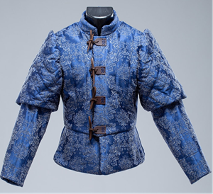

## 第七章

耶祖比尔注视着人类的呼吸。

房间里没有谁能看见它，但它习惯性地依附在阴影中，将黑暗如斗篷般披在身上。屋子很小，却很温暖，带着一股淡淡的草药味。那个老妇身形佝偻，在层层的编织毯下不安稳地睡着。有人在老妇人腹部放上了一束野花，尽管这束花没什么实际用处，但仍然是出于好意。

耶祖比尔从未见过她的脸，但它认识这个女人。事实上，它对她了如指掌。就像一个被困在黑暗荒原中的人会死死盯着平时根本不足留心的微弱光源，或者被锁在陵墓里的人会被针落地的声音吸引一样，耶祖比尔受到的监禁磨砺了它的感官。在它被关入地牢的一段时间后，它就开始感知到上方远处的那些痛苦。

这种感知永远无法替代近在咫尺地吞噬的痛苦。缪斯在上啊，这更无法替代由它亲手造成的苦难——但也聊胜于无。那些居住在总督宫里的人所产生的痛楚，曾是它维持生命的面包屑，是顺着牢房墙壁滴下的涓涓细流。它像舔舐救命的水滴一样品味这些痛苦，享用每一滴水露。那些突发的尖锐痛苦，哪怕再剧烈，也往往转瞬即逝，还没等耶祖比尔去感受，就已经无可觅得。

而那些熟悉的平常痛苦才是极品。有多少次，这妇人用那关节肿胀发炎的手指去擦拭石块？有多少次，她弯下结痂且嘎吱作响的膝盖，去清理一个无人记得的餐具室，一个没人会看到的架子，从事永远不会被感激的劳作？有多少次，因为她的牙齿太薄太脆，无法承受热饮的刺激，她只能坐下来，喝口温凉的茶？

这阴影所成之物隐隐笼在床头，吸吮着老妇人身上散发出的浓郁痛苦。即使在睡梦中，她衰老的肢体依然令她作痛。她的头也很疼，在那被手枪柄砸裂的地方，骨头变得松软而塌陷。她脑海中残存的微弱思绪里满是恐惧、愤恨与煎熬。耶祖比尔咯咯轻笑一声。真是有趣啊。这么多年来它一直哀叹只能从她身上寻找养料，而如今它终于解脱，一整座城市的折磨可供它畅享，它却又回到了她身边。她的痛苦它曾只能远远品尝，而现在它离它这样临近，这畅快的愉悦远超想象。这顿餐点多么清淡简单，却挑逗了它的感官将近百年。

在它的同族中，同情心是闻所未闻的。在它那冰冷无光的虚空家园中，每一道影子都饥肠辘辘，悲伤妖虫嘎嘎叫着嘲弄死者，而那些温暖心灵的情感，则像灯塔一样，呼唤着界域里的掠食者——在那片界域中，万物皆为掠食者。耶祖比尔无法对这卧床不起的老妇产生什么真切的同情，但它依然感觉与她有一种亲近。多年来，她一直是遥不可及，却又十分熟悉。产生同情或许超出了它的能力范围，但自私的占有欲却不然。想到她再也无法满足它的需求，它便感到一阵痛楚。而想到她可能会死去，且不是死在它的手里，它心中就燃起一股冰冷的愤怒。

耶祖比尔伸出一根漆黑的指爪，轻抚那干瘪凹陷的面颊。薄薄的皮肉在它的触碰下微微抽动，老仆人在睡梦中发出呻吟。耶祖比尔珍珠般的牙齿在唇间隐现，它向后消融在墙壁中。它意识到，或许还有一种方式能让她效劳。

---

真正让领导者不堪重负的是那些细枝末节。阿希尔的父亲从未告诉过她这一点。他本来不必说，他的一言一行每天都在向她诠释这个道理。每一项重大决策、每一次危机应对背后，都伴随着成千上万件琐事。阿希尔担任总督还不到一个月，就已经数不清自己签署或公证了多少份常规的批准、否决和授权文件了。

汉里克扫视着她办公室里的书架，叹了口气。坐在办公桌后的阿希尔露出了微笑。当鲁普雷克特坐在那张桌子后面，埋首于如山般的官僚琐事中时，他曾多少次听到家人发出类似的叹息？阿希尔敢打赌，那次数多到她数不过来。所以他才是卓越的总督。他从未推诿，从未动摇，从未在预定任务未完成时就提前下班，去捕鸟或陪孩子玩耍。风雨无阻，无论疾苦，他始终恪尽职守。

“人们已经为你的晚宴开始聚集了，”汉里克说，“德雷娜塔一定忙坏了。”

阿希尔从文书中抬起头。她的弟弟今晚脱下了法务官盔甲，换上了一件柔和蓝灰色的绗缝开衩紧身上衣，配以相应的紧身裤。这种风格有些别致，大概是索里努克斯式的，不过也足够文明得体。无论是出于巧合还是刻意为之，他选择的颜色正好与家族色相契合。阿希尔注意到，他甚至为自动手枪准备了一个装饰性枪套，上面用银线绣着马特科森的纹章。[^1]

阿希尔心头一紧。她意识到自己忘了告诉汉里克德雷娜塔出了什么事。

“不幸的是，并非如此，”她说，“德雷娜塔还在康复。”

她的弟弟转过身来，有些无法理解：“还在康复？”

她点点头。“她在暗杀事件中遭受的伤势比最初预想的要严重得多，”她说，“我已经让她情况稳定地修养，但我的医生告诉我，她的脑部受损严重，不太可能再醒来了。”为德雷娜塔提供最好的护理，这一点完全不用犹豫。与她处理过的许多其他问题不同，她不需要去想父亲会给出什么相关建议。德雷娜塔大半辈子都在为总督府服务，确保她得到照料是阿希尔为回报她的服务所能做的最起码的事。

汉里克皱了皱眉，转回身看向书架。阿希尔知道，在赛奥坎，没有多少人欢迎他的归来。少数几个曾对他敞开心扉的人之一又这样离去，这对他来说一定很不好受。她心想，弟弟这一生大概一直在遇到这种事，他现在可能已经对这种感觉习以为常了。德雷娜塔过去总能抽出额外的空闲来关心宫内孩子们的生活是否幸福，但阿希尔开始渐渐意识到，她曾经可能格外疼爱汉里克。

“真遗憾，”他说，“能见到一张亲切的面孔就好了。或者，至少能知道其在场也好。”

“我是否可以认为，伊多内尔法官今晚不会出席？”阿希尔微笑着看向转过身来的汉里克，想让弟弟知道她是在开玩笑。 “还是说，你与他的会面不怎么顺利？”

汉里克整理了一下腰带，皱着眉头。她有些好奇汉里克是否意识到，那一刻他看起来和他们的父亲有多相像。她熟悉那个表情：那是严厉、带有贵族派头的瞪视，正试图抵制一个显然不怎么专业的评价。

“伊多内尔法官不会出席，”他说。阿希尔看得出他内心很挣扎，不知道是否该对她再透露些什么。这是职责与家人情分的两难抉择。要他发表关于上级负面看法都这样不容易，那么如果他被迫出于职业原因介入此事，情况又该有多糟糕？

阿希尔在面前一份文件上签了名。那是发往卡里斯托尼安避风港的谷物运输常规授权书。如果要让汉里克和她父亲这样的人开口说话，关键在于给他们一个台阶下。

“我还没见过他，当然了，”她说，“为了应对他今晚可能的出席，我只能参考父亲的笔记。”她将申请书推到办公桌的另一边，刻意避开汉里克突然投来的目光。“他似乎认为伊多内尔对赛奥坎上出现的反常活动毫无兴趣。”

汉里克清了清嗓子，不安地挪了一下。这就对了：确认了她需要知道的一切。

“关于什么事情才足够重要，或者说，从帝国的宏观层面去看，”汉里克保持诚实与冒犯行星总督之间左右为难，更别说总督还是他的亲姐姐。“卡里斯托尼安的关注权重要比……或者说，某些事务是来自……”

“一个相对次要的世界？”阿希尔接话道，“相对于整个帝国而言？”

汉里克明显放松了下来。“没错。”

阿希尔签完最后一份文件，推开椅子站了起来。“汉里克，”她叹了口气，“我不像贵族议会那样自欺欺人。我或许没在索里努克斯受过教育，但我能清醒地认识到，赛奥坎只是整个帝国中相当微不足道的一部分而已。我相信那位法官在卡里斯托尼安忙到脱不开身。”

汉里克摇了摇头。“倒也不完全是那样，主要是因为卡里斯托尼安是交通流量的汇集地。我知道这看起来像是对赛奥坎的冷落，但非要说的话，这也是对父亲治理能力的肯定——因为法务官基本不需要在这颗星球上投入精力。”

阿希尔在离开前对着镜子最后检查了一下自己。她让汉里克为她开门，但坚持由自己来锁门。那次入侵过后，她无法信任任何人。

“那么，在你看来，法务官卷入权力斗争的可能性有多大？”他们边走边开始聊。

汉里克目视前方。“微乎其微，”他说，“伊多内尔几十年来一直设法置身于贵族政治斗争之外，并打算继续保持。只要什一税按时上缴，且入主达尔卡登的人能给他提供一个体面的表象，他就不会下场。”

“你似乎不太赞同啊，”阿希尔说。汉里克再次皱眉。

“我无权评判法官的行事方法，”他说。

“但如果可以评价呢？”

她的问题让弟弟停下了脚步。他驻足片刻，权衡着是否要对她坦诚相告。

“如果我处在伊多内尔法官的位置上，”他谨慎地说道，“我可能会倾向于对赛奥坎的局势投入更多的关注。”他重新迈开步子，避免与阿希尔对视。“当然，我的上级会理所当然地质疑我的动机是否源于私人恩怨。这就是我永远不会被允许在赛奥坎任职的原因。”

世事一直如此。事实上，赛奥坎的政治斗争规模还是比较小的。她知道，在索里努克斯那样的世界上，各大古已有之的帝国修会机构就像巨大的堡垒，在庞大的冲突中相互冲撞；对立官员之间一场微不足道的摩擦，就可能导致成千上万甚至数百万人丧生。赛奥坎则没有这些。他们唯一的法务官根本不在乎这颗星球。机械教和内政部都将卡里斯托尼安避风港视为首要关注点，并将大部分势力部署在那里。星语庭在赛奥坎甚至连办事处都没有，显然认为这个世界太不起眼，没必要派遣常驻的认证灵能者来负责收发星际通讯。整个星球上，只有她府中有一名指派过来的星语者，不过她知道有几个富有的豪门也供得起私人星语者。

她很高兴汉里克正陪她走在一起。对她而言，达尔卡登的长廊已不复从前。曾经，她从这片宏伟中汲取力量，高耸的拱门提醒她昂首挺胸，几千年来先民踏过的古老石基则为她的脚步注入力量；而现在，她行走其间，如何也打消不了心中的忐忑。穹顶天花板从未被完全照亮；又怎么可能完全明亮呢？她经过的每条幽暗走廊都可能是藏身之处。每一个阴影重重的壁龛间，似乎都存在着一双幽幽潜伏的眼睛。

她知道，那看不见的追踪者正从阴影中注视着她。而在达尔卡登，可以藏身的阴影无处不在。

---

“恐怕我要先失陪了，女士们。”坦泽格对着那群争相引起他注意的假笑贵妇们微笑。 “我的女同需要出去透透气，如果不陪着她，我还算什么护花使者呢？”他一边笑着，一边催促玛丽西亚动身。

他的女伴微笑着行礼。玛丽西亚是个老练的演员，丝毫没有表现出自己不属于上流世界的破绽。她擅长察言观色，能游刃有余地应对有关艺术、政治和金融的话题。没人会有理由怀疑她不是某个新贵商人的女儿，要么是格雷夫议会某位成员的远房亲戚，专程来科斯托维姆参加舞会，且很有可能正痴恋凡尼森家族的长子。

坦泽格坚持牵着玛丽西亚的胳膊，带她穿过侧廊。这就是他带她来的原因：骄纵的公子哥带着女伴偷偷溜进侧室不会引人怀疑。马特科森总督正忙于接见请愿者，其余的宾客正忙着算计如何背后捅刀子，根本无暇顾及他们。坦泽格找到了那条通往男仆大厅的狭窄楼梯，那是他之前与洛斯特罗夫斯基追踪阿希尔时走过的路。他可以对任何胆敢质疑他的普通仆人出言恐吓，但并没有人出现。

“在这里等着，”他对女伴说。玛丽西亚已经完成了她的使命，虽然她很有用，但他显然并不信任她。

他伸手进决斗背心，取出同位素追踪器。这件科技产品虽然古老，却依然可靠。屏幕闪烁着亮起，开始循环扫描追踪弧。他听到走廊里传来脚步声，但并没有自乱阵脚。他将追踪器低低地扣在腿上，用空着的手从胸前口袋里掏出一根洛烟棒，靠在墙边点燃。片刻后，两名仆人从拐角走来，合力抬着一盘手指三明治。[^2]坦泽格没理会他们。

待他们走远，他再次查看追踪器，发现已经有了回馈信号。不仅如此，目标离得很近。坦泽格自得地笑了笑，顺着走廊走去。追踪器和他本人一样急于完成任务。其他贵族或许不屑于亲自动手，而坦泽格也同样不乐意处理杂活。然而，当涉及到实施家族阴险计划的时刻，坦泽格更喜欢亲自出马。上次他来访时，洛斯特罗夫斯基曾试图说服雇主不要随他潜入宫殿。那时坦泽格就一如既往地坚持要参与行动。在施加痛苦和扼杀生命这件事上，洛斯特罗夫斯基这类人仅仅是有事办事，而坦泽格才是那位艺术家。

仆人走廊里冷风呼啸，如在梦中。凡尼森家族的宫殿里也有仆人走廊，但那些走廊狭窄、紧凑且实用，灰泥墙面毫无装饰。达尔卡登始建于更为古老的时代，其支撑结构也证明了这一点。头顶呈弧形支撑的扶壁让人联想到巨兽的肋骨，仿佛一具早已死去的躯壳被改造成居所，供新一代人继续生活在其阴影之下。

宏伟厅堂里的热气永远无法渗透进这些侧廊，无法彻底温暖这里；侧廊中弥漫着一股如有实质的阴冷。男仆休息室里供仆人们休息进餐的小壁炉或许能稍稍缓解寒气，但即便如此，这里的空气仍比达尔卡登的其他地方更加冷冽。他残忍地咧嘴笑起来。如果没有人定期维护，这里的墙壁和地面都会因冷凝水而变得湿滑。苔藓会爬满整条走廊，而巨大的蛛网将占据头顶的拱门。如果坦泽格需要点什么来证明他和王座上那个自命清高的女人并非一路，那么这些走廊毫无疑问给出了证据。他心中感到，当这些厅堂归他所有，那景象将何等壮观！

同位素追踪器将他带到了那扇他曾重击老女仆的门前，这并不出人意料。这扇门曾被一把极其复杂的锁封死，那是他从未见过的技术奇迹。那设备的数字屏幕现在是一片空白，其机魂已然魂飞魄散，无疑是毁于洛斯特罗夫斯基之手。坦泽格用手指划过设备裸露的内部构件。

“你当时在搞什么叛教的好勾当？”他低声说。玷污机械教的圣物？他知道洛斯特罗夫斯基是个嗜血的小变态，但没意识到他竟能做出这种亵渎之举。

坦泽格向走廊两端扫了几眼。他听到远处有些回声，但这在预料之中。近处并无异样。他从外套里掏出一套开锁工具，开始对付那把锁。那很不好应付。阿希尔那古老且无可替代的生物锁或许已经毁了，但她至少还有脑子换上一把异常坚固的替代品，尽管那是纯机械锁。锁链太粗，即便有工具也无法切断，但坦泽格是赛奥坎最富有的人之一，他的财富为他提供了许多小玩具，其中就包括一套工艺精湛的水晶开锁工具。他不知道这东西从何而来，只知道卖给他的走私者后来在卡里斯托尼安避风港因持有异形造物被捕。但他所知道的是，这些工具从未让他失望过，而且在使用时似乎能放大他的感知力和敏捷度。

锁最终还是屈服了，就像曾经摆在坦泽格面前的所有障碍一样。他在门后发现一间秘密储藏室，这没有让他太惊讶。泰雷桑特将军的画像让他停顿了一下，他漫不经心地检查着屋里的藏品。一张矮桌上放着一小块愚民粉，一个编织篮里有三颗快乐石，还有一小片裹在薄纸里的红玻璃碎片。

这可真是个惊喜。马特科森家一向规规矩矩，不料竟也有接触违禁品的嗜好。他在房间里走动，更仔细地检查里面的东西：一套哈拉德尼叛徒军团的军官制服，那些人在第一代马特科森统治时期曾试图渗透卡里斯托尼安避风港；一幅出自“恩奇迪欧斯飞地”的水彩画，那是一群臭名昭著的艺术家，几个世纪前因异端罪被处决；还有一堆带有钛帝国纹章的代币。

他叹了口气。没什么真正有趣的东西。他自己的秘密地窖里的藏品……要古怪得多。不过，如果他能找到办法揭露这间密室的存在，依然能让这位新任总督头疼不已。他考虑过顺走一两样东西来要挟她，但随即打消了这个念头。这里的东西都不足以引起真正的大调查，也没有什么物品太过恶劣，以至于拿“没收后被遗忘的异端物品”这个说法解释不通。坦泽格将注意力转回追踪单元，屏幕显示奴隶标签留下的同位素痕迹穿过了密室的墙壁。

移开桌子后露出的暗门让坦泽格几乎笑出声来。

他从口袋里掏出发光球，小心翼翼地沿着楼梯走下去。一间收藏异端物品的密室并不算什么大新闻，如果哪个统治家族的宅邸里没有这种地方，他反而会更吃惊，哪怕那些下层格雷夫拿不出什么值得称道的异端藏品。但是，一间隐藏的地牢？这可就有趣多了。

远在到达楼梯底部之前，他那老练的鼻子就闻到了烂肉的臭味。当他的靴子踏出台阶，踩上底部某种胶质物时，他认出到了那独特的黏响。他将发光球降到膝盖高度，好奇地想看看下面到底散落着什么。

“喔，真有意思，”他说。他认出了洛斯特罗夫斯基那副滑稽的小眼镜，镜片上沾了一层薄薄的油脂。不远处，一块腐肉中露出胫骨圆润的末端。他缓慢地扫视地面，心里清点着他这仆人大部分的残骸状况。

多了不得啊。他早就怀疑马特科森家族隐藏着不为人知的黑暗秘密，但这超出了他最狂野的想象。去他妈妈想要的吧：如果阿希尔有这样的手腕，他愿意和她玩一场长线游戏。他要改变战术，展现出更迷人的姿态，但要找个法子赢得她的芳心。他高举发光灯，踏着洛斯特罗夫斯基的残骸出发。他很好奇阿希尔对他刺客的头做了什么。对此他毫无头绪，但光是想到她拎着头走了，就比她做过的任何事都更有趣。

这迷宫引人入胜。幸运的是，洛斯特罗夫斯基留下了可供他追踪的痕迹。这些痕迹大概是无意中留下的，因为它主要由刺客本人的鲜血构成，但凡尼森家族的继承人可以忽略这点。看来洛斯特罗夫斯基最后还是对得起他的佣金。

---

如果说阿希尔对机械教真的有什么欣赏之处，那就是他们对效率的执着。与其他所有一味谄媚献忠，或者油滑地企图将自身命运与她绑定的忠实公民相比，这位火星祭司的代表言辞直截了当，简介明了，且充满枯燥的技术术语。

“如果我承认自己一个字也没听懂，你会看轻我吗？”汉里克问道。他声音很轻，但阿希尔还是忍不住露出微笑。“我大概听懂了些关于海洋和采矿的事，但也就仅此而已了。”

舞会上的宾客们似乎专注于美食、音乐，或是她那些多种多样的艺术展品，但这些干扰项都只是掩护，掩盖了宾客们真正的关注目标：总督本人。阿希尔知道所有人的目光都聚焦在她身上，评判着她，试图揣测她的政府将走向何方。

明明在自己家里，却感觉像个陌生人，这种体验对她来说并不新鲜。宴会厅里挤满了格雷夫议会的成员及其家眷，此外还有各路能人专员、社会名流，以及其他财力或影响力惊人，足以获邀出席的公民。加冕和国葬都是肃穆庄重的场合，要保持庄严与仪式感；但在新任总督就职后的“献身晚宴”则是一场真正的庆典，对许多人来说，这是终生难遇的盛事。人群纷纷盛装出席，大多数贵族身上的衣物造价，他们手下的仆人干一辈子都买不起。锦绣的丝绸、尼奥泰克斯领口和翠菲迪安羽毛随处可见，还有更多稀罕独特的材料，皆出自这颗星球上最顶尖的裁缝和服装商之手。

如果说这场招待会是她向赛奥坎贵族们的自我介绍，是她发表开场白的机会，那么她早早就决定好，这将是一篇保守与富足的宣言。环绕着达哈维尔宴会厅的封闭式柱廊大厅“梅塞内特柱廊”经过重新布置，陈列着马特科森家族最精美的艺术品。来自星球各地的绘画、编织品、家具和雕塑悉数展出供人瞻仰，其中许多藏品的年代甚至比在场贵族家族的历史还要久远。她的厨师没有制作任何新奇或古怪的菜肴，没有从外星进口任何东西，也没有设计大型厨艺秀。相反，从丰盛的科斯托奇牛排到咸佩卢西迪安鱼肉馅饼，她所提供的食物充分展示了赛奥坎菜肴的丰富内涵。两支器乐合奏团分别安排在宴会厅两端，交替演奏着赛奥坎历史上流行过的各种音乐风格。

尽管周围全是急于探她虚实的人，但有汉里克陪在身边还是让她感到了一丝慰藉。他是一个支持性的存在：尽管二十年相隔万里，但他依然是她从小就认识的家人，与她流着相同的血脉，至少在核心价值观上和她一致。同时，他作为过客的身份，反而增加了他的安全性——他不会久留，因此对任何潜在对手的长远计划而言都毫无价值。这种奇妙的组合，最终使他比周围任何人都更令她感到安心和可靠。

“我大致听懂了，”她说，目光追随着从容离去的贤者，“他请求我们在他的团队进行矿物勘测期间，转移北冰湾的捕鱼活动。至少火星祭司的做法很直接。除非我传唤他，否则这可能是克罗菲尔德贤者与我今年唯一的一次会面，而且总督通常只有在紧急情况下才会召唤他来。所以，逻辑表明，他现在已经提出了所有的要求。说实话，我更喜欢这种直接的风格。”

下一位恳求者已经朝他们走来了。阿希尔坐在远离舞者与食客的高台上，这块高台由埃布利特大理石筑成，石面天然的冷光在开采后的数百年间已经变得黯淡，呈现出微弱的黄色。那些渴望与她交谈的人必须登上那宽阔而平缓的台阶，上到她面前，在她那张铺有软垫的宝座前向她致意。这张王座由特伦科维沼泽中采捞的费伦木制成，覆以鲜红的天鹅绒。岁月已将木材染成了富有光泽的漆黑色。提供这种木材的树种在人类踏足这颗星球之前就已灭绝，它们沉入长满苔藓的泥沼中，经过数千年的石化过程留存至今。那根最终成为赛奥坎王座的树干，在神圣泰拉的天空与海洋依然蔚蓝的时代，便已度过发芽、生长与枯萎的历程。

玛格雷夫·拉加雷特·加沃兹尼是一位阿希尔从未亲身见过却早有耳闻的女性。大学期间，阿希尔与保拉在多次长谈中，彼此分享过对各自家人的私人看法。保拉的父亲和阿希尔一样，也是家族统治者的次子。但与阿希尔不同的是，他的姐姐没有英年早逝，并在汉里克出生后不久便成为了玛格雷夫。加沃兹尼家族依靠化学加工行业积累了财富，特别是染料工程，随着时间推移，他们的业务又有所扩张。根据保拉的说法，她这位拉加雷特姑妈是个意志坚定的女人，从不让忠诚、仁慈或同情心妨碍家族金库的充盈。

“马特科森总督大人，”拉加雷特走到最后一级台阶时说道，“感谢您的盛情款待。请允许我介绍我的女儿，奎勒薇娅·加沃兹尼。”

玛格雷夫·加沃兹尼是个健壮的女人，身材矮小，肌肉结实。据阿希尔所知，她并不从事体力劳动，她强健的体格纯粹是自己磨练出来的。在保拉口中，这位玛格雷夫年轻时曾是一名出色的赤手拳手，且不介意利用自己的体格来威慑那些与她有业务往来、无所事事且浑身香水味的贵族。

奎勒薇娅与她的母亲很不相同。她的双手交叠在身前，目光羞怯地垂着。她身材娇小，畏畏缩缩，低声重复母亲的感谢词，声音因恐惧而颤抖。

“很高兴见到两位，”阿希尔说，“要来些甜点吗？”她示意站在身旁的一名机仆，后者正托着一盘冰凉的微微颤动的马科雷利安明胶方块。这名机仆和所有穿梭在人群中托着食物与饮品的机仆一样，都是神经反馈工艺的杰作。它们皮肤洁净，穿着马特科森家仆的制服，人造部件经过润滑和保养，运转悄无声息。那一张张呆滞的面孔掩盖在瓷制面具之下，这些面具是根据以往宫中老仆的面孔打造的。这些机仆成了宾客们特别关注的焦点。卡里斯托尼安避风港内的工厂吸纳了赛奥坎生产的大部分机仆，而剩下的多数则为农业工厂所用。大多数贵族家庭只能负担得起一名机仆，许多家庭甚至一个也没有。

“您太慷慨了，大人，但不必了。”玛格雷夫·加沃兹尼微微苦笑。阿希尔暗自揣摩这女人在玩什么把戏。“是我的女儿有求于您。”她转头看向奎勒薇娅，“别只在那儿站着，孩子。总督大人的夜晚很忙碌。”

“万分抱歉，阁下。”奎勒薇娅似乎不知道该做什么，只好行了个屈膝礼。“是这样，我现在已经到了可以拥有个人产业的年纪了。”

“我明白了，”阿希尔说。她微笑着前倾身体，尽量放松姿态，让自己显得不那么令人生畏。

“我们家族的产品需求量目前……呃，很大，”年轻女子一边说，一边不安地偷瞄母亲，“然而，我家族的长辈们已经充分满足了这些需求。”

阿希尔理解女孩的困境：她不想道出赤裸的真相而招致母亲的不满。幸运的是，阿希尔对赛奥坎的经济近况了如指掌，她很清楚加沃兹尼家族的财务状况虽然稳固，但目前已无扩张空间。不断增长的人口需要的是住房，而不是织物染料。

“你有什么想法吗？”阿希尔问。管理贵族家族的传统产业是家族成员最常见的选择，但绝非他们唯一能从事的职业。

奎勒薇娅点了点头。“是的，阁下。我有一位合伙人，也是我的未婚夫，西奥多·阿克拉文，他是职业酿酒商。”阿希尔对这个名字不熟悉，这意味着这位合伙人并非出自任何统治家族。不过，奎勒薇娅是家里的第三个孩子，她的家族不会干涉她跨阶层下嫁。

然而，阿希尔看出了其中的麻烦，以及玛格雷夫·加沃兹尼自认为给阿希尔设下的陷阱。虽然各个贵族家族的贸易产业没有定死，但家族行业在法律上是受保护的。食品生产无疑是马特科森家族的领地，而葡萄园则处于法律的灰色地带。一些法庭裁决将其归类为食品或饮料企业，因此属于马特科森家族的管辖范围。而另一些裁决，特别是针对那些规模极小又尤其顶尖的庄园，则将酒业定为艺术创作视野，因此在法律默认上不属于任何家族。

更加棘手的是，所有最适合种植维提浆果的土地都是优质耕地，因此除非得到特别许可，都归马特科森家族所有。如果阿希尔想要帮助奎勒薇娅·加沃兹尼，她就需要拨出一部分自己的土地，并将一项按理说可以算作她自己的业务，拱手让给一个并不支持她的贵族家族。而如果她拒绝，就会显得小气吝啬，死守一块自己根本没在使用的弹丸之地，从而破坏她为自己塑造的感性且通情达理的形象。

“多好的主意，”阿希尔说。她直视着玛格雷夫·加沃兹尼的眼睛。“我想，我可以有条件地，在特伦科维湾郊外划出几平方英里的土地。比方说，十五平方英里如何？”

加沃兹尼家的女人们震惊地瞪大了眼睛。此前从未有这种规模的葡萄园被归类为“艺术事业”。

“什么条件？”拉加雷特问，怀疑地眯起眼睛。

阿希尔露出微笑。“按贸易税率缴税，直到该房产价值清偿完毕。除标准什一税和各种赋税外，你女儿每年酿酒产量中还有百分之一需上缴总督宫。”她对奎勒薇娅点了点头，“毕竟，我们必须保证自己的窖藏充足。”她转回身面对拉加雷特，仿佛随口想起似的，又加了一条。“此外，无论是季节短工还是长期劳工，都必须永久从总督指定的城市中招募。可以先从，嗯，赛尔佩加姆招募三百名工人开始。”

玛格雷夫·拉加雷特几乎要笑出声来。这些条款相当慷慨，更重要的是，它们对加沃兹尼家族的财富毫无损害。然而，这对于凡尼森家族来说就不太妙了——他们已经接下了在赛尔佩加姆建造额外住房的合同，既然有几百名工人要被迁往另一个大陆，其中一些房屋恐怕就要闲置下来了。

“感谢您，阁下，”奎勒薇娅激动地说道。阿希尔向她亲切地笑笑并挥手致意，随后年轻女子的母亲便领着她走下高台，消失在人群中。又一个来自敌人的小伎俩被化解了。至少这一个处理起来相对轻松。

汉里克看着人群，等待下一位宾客到来，表情不太愉快。“他们都有所图谋。全都是这么……贪婪。我原以为今晚是向你表达忠诚的时刻。”

她再次微笑，这一次笑得坦率而真诚。自从她走进宴会厅的那一刻起，前来恳求的人就络绎不绝，而且很可能会持续一整夜。

“他们中的大多数确实在用漂亮话和微不足道的礼物来表达忠诚，”她说，“然后，当然了，他们想趁着我还没来得及判断他们是否真的忠心耿耿之前，就抓紧将这份忠诚变现。”

这些礼物对她来说意义不大，唯有极少数几件既贴心又有深意，比如早些时候保拉送来的那本压花封面的新守法主义诗集。这正是她试图传达的形象。从美食到音乐，再到艺术品，甚至是她向格雷夫议会敞开的宏伟的达尔卡登，一切都在诉说着同一个信息。宴会厅那巨大的拱形肋、古老的王座，以及来自星球各个角落的精美或寻常的物品，都向在场所有人表明：一切尽在她掌中。她选择达哈维尔宴会厅举行献身晚宴绝非偶然。作为宫殿北侧的最高点，梅塞内特柱廊的玻璃窗提供了绝佳的视野：南面和东面是宫殿的美景，北面的乡间风光起伏连绵。向西望去，整个科斯托维姆城尽收眼底，灯火延伸至地平线，与夜空的繁星浑然相合。

她希望这个信息能清晰地传达出来：这个人无所不有。她不是在炫耀，而是凭借完整、威严与可靠，来表明自己的资源在赛奥坎近乎无限。她的财富无穷无尽，因而不需要收受贿赂。如果她必须以一个宣言来开启她的统治，那么她会宣布自己是不可收买的——因为没有什么是她不曾拥有的，也没有什么是她无法献给她的世界的。

“这太糟了，”汉里克说，将她的思绪拉回到眼下的对话。

“在索里努克斯，情况真的会有所不同吗？”阿希尔问道。

“索里努克斯是一座圣殿世界，”他说，“所以，那里有影响力的精英往往是国教成员，他们会更注重维持虔敬忠诚的形象。”

她本希望能再多聊一会儿，既是为了推迟那许多不可避免的个人请求，也是为了多听听弟弟新家的情况，但巴林的到来终结了这段对话。这位上校严肃的表情告诉她，他此番前来绝不仅仅是出于社交礼仪。

“夫人，”他说。

“什么事？”

“有人发现一名访客偷偷潜入了主厅外的仆人走廊，”他低声说道。

阿希尔意识到有多少双眼睛正盯着自己，于是微笑着，仿佛他刚刚说的只是些迷人且无伤大雅的小事。

“是谁？”她问。

“坦泽格·凡尼森，还有他的女伴。”

坦泽格·凡尼森在她宫殿长廊里暗中活动，这念头已经足够令人不安；而更让她忧心忡忡的是，他可能怀有更大的阴谋。

“他在哪里被发现的，菲达尔？”她微笑着倾身，仿佛在为一个私密的笑话而发笑。

“在织造厅附近，夫人。”

她内心怒火中烧。如果说坦泽格只是潜入阴影，与他花钱雇来的随便哪个女人幽会，她尚可将其视为单纯的巧合；但在她差点被逼入绝境的那个男仆厅附近？她父亲说过这样一句话：阴谋出巡时，巧合便是它戴的面具。她开始领悟其中的道理了。

“那我们就该去看看他是否需要什么帮助，”她起身说道。

汉里克也站了起来，脸上有些困惑。“一个溜走的客人？这值得你亲自介入吗？”他问道。

她还是把握不住到底能向汉里克透露多少信息。如果把一切和盘托出，包括耶祖比尔的事，或许就超出了他的承受能力。毕竟他是一名法务官，她不敢奢望血缘纽带能比他立下的誓言更加重要。然而，如果事情发展到不可收拾的地步，她可能还是需要他的协助。

“织造厅是离我遇袭的走廊最近的地方，”她说，“如果刺杀我的刺客或雇佣他的人想要回到袭击现场销毁证据，或者确保没有证据遗留，那里就是必经之路。”

汉里克点了点头，她很庆幸要他协助无需更多解释。她的弟弟示意菲达尔领路，三人穿过人群，阿希尔微笑着回应了所有关于她离席的询问，随口解释称有一件琐碎的家事需要处理。

她考虑过召集守卫，但她不能无缘无故地逮捕坦泽格。毕竟从舞会上溜走去弄臭一条侧廊，很难算得上什么叛国罪。虽然逮捕坦泽格甚至整个凡尼森家可能不会引起民众公愤，但那些对这个辅政家族效忠（无论是受迫还是自愿）的格雷夫议会成员，却会给她带来无尽的麻烦。

令她沮丧的是，他们根本没抓到坦泽格做任何出格的事。她原以为自己赶到时，能抓到他正试图强打开地窖的门，但她不悦地发现他正迎面朝她走来，身边还带着一个阿希尔不认识的女人。

“啊，阁下，”他开口道，声音略显含混，“真是意外之喜。”

走廊本就狭窄得令人不适，此刻因空气中突然弥漫的紧张感而越发显得拥挤。坦泽格的女伴浑身僵硬，目光在法务官、上校和总督之间来回打量。阿希尔对这个可怜的女人产生了一丝同情。显然，尽管她极力作出贵族的姿态，但她出身并不高贵。无论坦泽格需要她做什么，阿希尔都怀疑这女人绝没料到自己会陷入总督大人、法务部官员，以及星球上权势最显赫的犯罪领主之一之间。她倒是很佩服这女人的镇定自若；她曾见过不少人在远小于此的压力下崩溃。

“我的这一晚确实充满惊喜，”阿希尔说道。

“我也一样，”坦泽格回答，“这些古老的建筑里到处都是。”

“通常情况下，人们不会认为酒窖里会有什么惊喜。”汉里克说。

“这我就不知道了，”坦泽格说，“因为阁下把酒窖锁在了一条相当惊人的锚链后面。我想，如果手下没有值得信任的仆人，那确实需要采取这种预防措施。”

“是啊，遗憾的是，达尔卡登这些日子似乎窝藏了不少奸诈之辈，”她说。

“确实。”汉里克的语气中带上了一种阿希尔从未听过、却又莫名熟悉的语调。“您这么匆忙是要去哪儿，凡尼森先生？”那声音冰冷且毫无波澜。如果陶钢会说话，听起来大概就是那种腔调。

坦泽格举起双手。阿希尔心想，这种孩子气的笑容和无辜的姿态，究竟多少次帮这个凡尼森摆脱了麻烦。就算因为没有被尊称头衔而感到愤怒，他也没有表现出来。

“十分抱歉，马特科森大人，”他说，“发现一间以这种方式锁上的密室，我总会感到应当警觉。你在索里努克斯长大，可能有所不知，在赛奥坎的统治家族中，用几间密室来藏起各种堕落勾当以避人耳目，并不是什么罕见的事。”他向阿希尔眨眨眼。“当然，我绝不认为阁下会沾染这种恶行，但在这样一个看似无害的区域布置如此严密的防御措施，我心里难免拉响了警报，你懂的。我觉得还是尽快撤离为妙。”

阿希尔眯起眼睛。他试图把怀疑指向她，这企图简直荒谬。他怀疑他的手下洛斯特罗夫斯基失踪在这附近，但如果他没能进那扇门，他就永远无法证明。

“撤离似乎是最好的选择，”汉里克说，“如果你和这位小姐有急事必须离开，我也不想留难二位。”

看着坦泽格脸上的笑容逐渐消失，阿希尔努力保持神情严肃。这位年长的贵族正试图揣摩自己是被礼貌地打发了，还是受到了隐晦的威胁。他身边的女人则因得到了脱身的机会而如释重负。

坦泽格的面具终于重新戴稳了。“那是自然，”他说，“你知道的，当一段关系尚且新鲜激情时会是什么感觉。”他停顿了一下，“或者，我相信你以后也会明白的。”

汉里克让开道路，朝后方点了点头。坦泽格对着女伴做了个夸张的引路手势，随后从他们身边掠过。狭窄的走廊里，与她擦肩而过的瞬间，坦泽格锁住阿希尔的目光，咧嘴一笑。那不像是设法逃脱惩罚的麻烦无赖该有的笑，而更像是一个男人真心想要展现魅力的神态。阿希尔一阵反胃。

在楼梯顶端，离开了仆人走廊，坦泽格的随行同伴似乎克服了先前的胆怯。

“噢，阁下，”她赞叹道，指着附近墙上挂着的一幅挂毯，“我从未见过如此精美的作品。不知能否烦请您解释一下它的来历？我坦白，我这方面的学识有些捉襟见肘，但我听闻您是大后复苏时期文物的权威。”

阿希尔向这位女性露出一个典雅的微笑。

“当然可以，”她说，“这幅作品描绘的是在贝斯泰里安分水岭战胜军阀恩戈什的场景。它是少数未经审判庭批准而创作的审判官画像。当然，审判官埃切瓦里亚在画中的形象经过了刻意处理，与他本人完全不同……”她继续侃侃而谈，而那位年轻女子不时点头并穿插提问，完美地表现出一副听得入迷的样子。

她不得不赞赏这女人的演技。阿希尔甚至没有捕捉到坦泽格肯定发出过的、让她制造干扰的信号。作为一名骗子，她的才华无懈可击。她能够引用具体的信息（从阿希尔自己的谈话内容中摘取的），使她看起来像个热情的艺术史爱好者。如果这女人没有在谈话开头把一件前索拉里安时期的作品误认为来自后复苏时期，阿希尔恐怕根本没理由怀疑她那伪造的学识。

“恕我失礼，阁下，我正打算带我的同伴去欣赏西边那迷人的景致。”坦泽格插话道，礼貌地挽起那女人的手臂，举止端庄得体。那女人向阿希尔点头致谢，随后被领走了。阿希尔由衷地希望坦泽格没把这女人推入危险之中。她知道，耶祖比尔并不是她放进达尔卡登厅堂里的唯一一个怪物。

---

[^1]: 类似这种服装：

[^2]: 手指三明治是社交场合那种切成小块两口一个的三明治。

[前往第八章](to8)

[返回目录](index)

